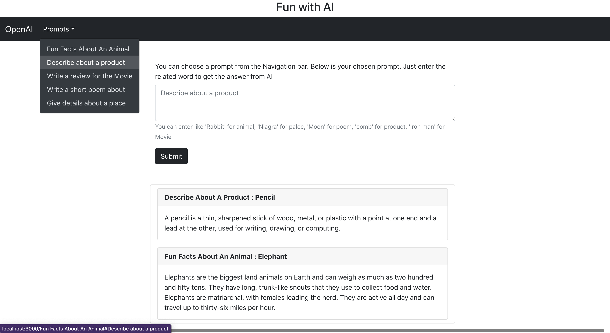
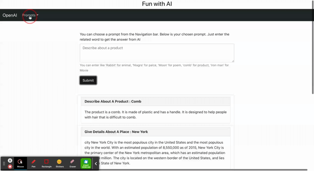

# Fun with AI

This project retrieves prompt results from OpenAI API for the given prompt

**What I Learned**

- How to communicate with API using axios
- Communication between components in the same level in REACT
- Using Context API store and access data between React components

**Fun with AI**

## Description

- This project fetches the data from the following public API https://api.openai.com/v1/engines/text-curie-001/completions
- This API provides completion for the given prompts
- By using this project one can choose from one of the prompts and enter the specific object for that prompt and get completion answers from the AI

## Installation

- Download this project in your working directory through, \
  git clone https://github.com/vanisbala/openai-prompts
- cd into the new folder and type
  $ npm install
  it will install the required dependencies.
- Create account in OpenAI and get the api-key
- create a .env file in the main folder and enter the api-key from Open AI like this
  REACT_APP_API_KEY=paste your api-key here
- To run the react project
  $ npm start

**Demo** \

## Built with

- [React-Bootstrap](https://react-bootstrap.github.io/)
- [React](https://reactjs.org/)

## Deployed Link

- [See live Site](https://vanisbala.github.io/openai-prompt/)

## Author

### Vani

- [Link to Github](https://github.com/vanisbala)
